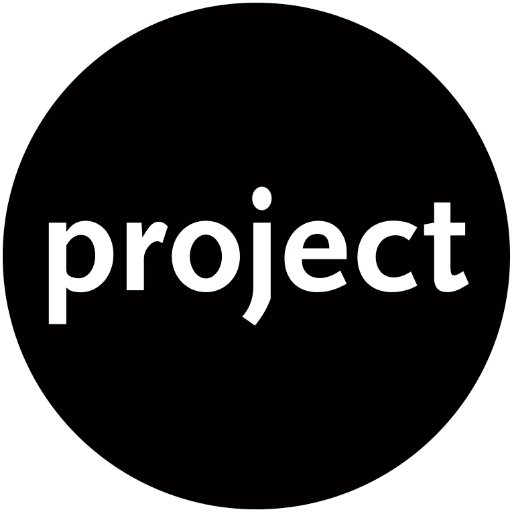

  

<h3 align="center">Cogworks Umbraco Essentials</h3>

  

##### Build status

| <!-- --> | <!-- --> |
| -------- | -------- |
| **Changelog** | |
| **GitFlow** |  |
| **Build** |  |
| **GitHub Packages** |  |
| **Our.Umbraco Package** |  |
|<!-- --> | <!-- -->|

##### Packages

| <!-- --> | <!-- --> |
| -------- | -------- |
| **GitHub Packages** |  |
| **Our.Umbraco Package** |  |
|<!-- --> | <!-- -->|

---

Table of Contents

- [About](#about)
- [Usage](#usage)
- [Changelog](#changelog)
- [Diagrams](#diagrams)
- [Notes](#notes)

## About 

Umbraco essentials.

## Usage 

Add notes about how to use the system.

## Changelog 

All notable changes to this project can be found in [CHANGELOG.md](CHANGELOG.md).

## Diagrams 

All the information about diagrams can be found in [Diagrams.md](Docs/Diagrams.md).

## Notes 
